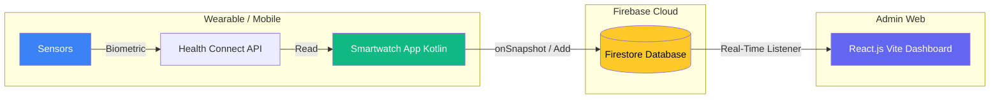

# ⌚ Mi-Admin Smartwatch Telemetry System

Sebuah ekosistem *end-to-end* untuk pemantauan data kesehatan biometrik (*Telemetry*) secara *real-time*. Proyek ini menjembatani pembacaan sensor pada perangkat cerdas (berbasis Android/Wear OS) ke panel analitik berbasis web secara mulus tanpa batas menggunakan integrasi **Google Health Connect** dan **Firebase Firestore**.


---

## 🏗️ Arsitektur Sistem

Sistem ini didesain sepenuhnya secara *Serverless*, menyingkirkan kebutuhan server backend terpisah dengan mendelegasikan beban data ke ekosistem Firebase.



## ✨ Fitur Utama

### 📱 1. Aplikasi Android (Smartwatch/Mobile)
*   **Integrasi Health Connect:** Mendapatkan akses resmi dan *permission-based* dari Google untuk membaca **Heart Rate (Detak Jantung)**, **Steps (Langkah)**, dan **SpO2 (Oksigen Darah)** dari sensor bawaan.
*   **Live Broadcast:** Melakukan transmisi asinkron (*polling*) kelipatan 5 detik yang secara otomatis melempar paket payload ke Firebase.
*   **Defensive Mechanism:** Perlindungan *Crash-Free* pada siklus hidup aplikasi apabila akses sensor tidak diizinkan.

### 💻 2. React Admin Dashboard
*   **Dashboard Kelas Enterprise:** Menggunakan rancangan antarmuka *Dark Glassmorphism* yang khas seperti aplikasi "Mi-Admin".
*   **Time-Travel Analytic:** Pengguna dapat menembak mundur melihat histori spesifik ("Yesterday", "Today", "7 Days Ago") beserta grafik datanya secara interaktif.
*   **Multi-Metric Chart:** Memiliki Tab Pemilih dinamis yang akan mengubah grafik *Chart.js* dan kalkulasi statistika (Average/Peak) berdasarkan metrik yang sedang dilihat.
*   **Always-Live HUD:** Metrik angka pada kartu utama dikunci pada fungsi pendengaran sinkron untuk memastikan angka tidak pernah "Basi" walau user sedang melihat histori tempo lalu.

---

## 🛠️ Tech Stack Prioritas

*   **Android App:** Kotlin, Coroutines, Material3, Health Connect API, Firebase BoM.
*   **Web Dashboard:** React 19, Vite, Chart.js, Firebase JS SDK v12, Vanilla CSS Premium.
*   **Database:** Firebase Firestore (NoSQL).

---

## 🚀 Panduan Instalasi & Setup

### A. Persiapan Ekosistem (Firebase)
1. Buat proyek baru di [Firebase Console](https://console.firebase.google.com/).
2. Aktifkan **Firestore Database** dan mulai dalam `Test Mode` (atau atur Rules agar meneteskan *Read/Write* bebas sementara).
3. Buat dan daftarkan aplikasi tipe Android Anda (Ambil `google-services.json`).
4. Buat dan daftarkan aplikasi tipe Web Anda (Dapatkan *Firebase Config API Keys*).

### B. Menjalankan Aplikasi Web (Dashboard)
1. Buka folder repositori web:
   ```bash
   cd web-dashboard
   ```
2. Instal prasyarat Node:
   ```bash
   npm install
   ```
3. Buka file `src/App.jsx` dan sesuaikan objek `firebaseConfig` dengan konfigurasi milik Anda.
4. Nyalakan mode *development*:
   ```bash
   npm run dev
   ```

### C. Menjalankan APK / Modifikasi Android App
> Note: Apabila Anda hanya ingin melakukan tes, silakan kunjungi menu [Releases](https://github.com/rendi-hendra/smartwatch-realtime/releases) dan instal `smartwatch.apk` ke *device*.

1. Buka project menggunakan **Android Studio**.
2. Salin file `google-services.json` milik Anda ke dalam folder `app/`.
3. Tambahkan **SHA-1 Fingerprint** (Dari menu Gradle -> Task -> android -> signingReport) ke setting project Anda di Firebase (Wajib untuk OS Android Moderen).
4. Pastikan aplikasi/wearable OS emulator yang akan di*run* sudah memiliki aplikasi resmi "Health Connect" di bawaannya.
5. Klik **Run / Play** pada Android Studio. Posisikan switch *Connect* menjadi `ON` lalu berikan semua perizinan layar sentuh untuk menambang sensor.